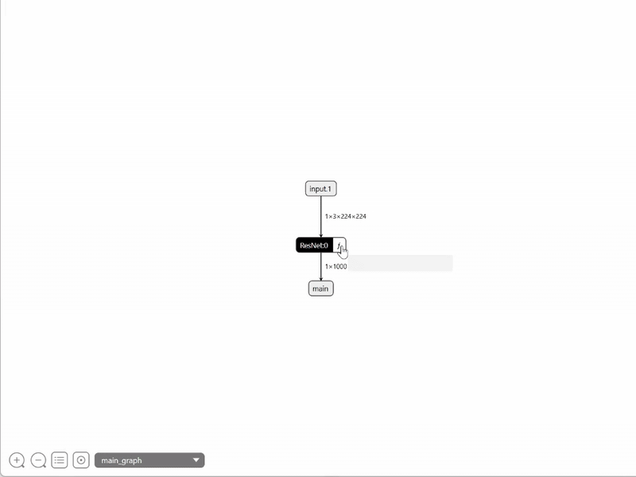
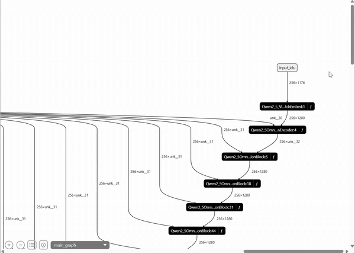

# 🚀 HYPER-ONNX

[中文](./README_CN.md)|[EN](./README.md)

Hyper-ONNX 可以以层级化方式导出 PyTorch 模型（`nn.Module`）。它能保留模块层级信息，并生成嵌套的 ONNX 图。✨


## 📦 安装

直接从 PyPI 安装：

```bash
pip install hyperonnx
```

或从源码安装：

```bash
git clone https://github.com/LoSealL/hyperonnx.git
pip install -e hyperonnx[test]
```

## 🧪 使用示例

### 1) 导出带指定层级信息的 `nn.Module`

```python
import torch
import torchvision as tv
from torchvision.models.resnet import BasicBlock, Bottleneck, ResNet

from hyperonnx import export_hyper_onnx

model = tv.models.resnet18()
export_hyper_onnx(
    resnet,
    (torch.randn(1, 3, 224, 224),),
    "hyper-resnet18.onnx",
    input_names=["img"],
    output_names=["features"],
    hiera=[ResNet, BasicBlock, Bottleneck],
    do_optimization=False,
    dynamo=False,
)
```



### 2) 通过自动追踪导出模型的任意调用

```python
from hyperonnx import auto_trace_method
from hyperonnx.patch import patch_transformers
from transformers import (
    GenerationConfig,
    Qwen2_5OmniThinkerForConditionalGeneration,
)
from transformers.models.qwen2_5_omni.modeling_qwen2_5_omni import (
    Qwen2_5_VisionPatchEmbed,
    Qwen2_5_VisionRotaryEmbedding,
    Qwen2_5OmniAudioEncoderLayer,
    Qwen2_5OmniDecoderLayer,
    Qwen2_5OmniPatchMerger,
    Qwen2_5OmniVisionBlock,
)

thinker = Qwen2_5OmniThinkerForConditionalGeneration.from_pretrained(
    "Qwen/Qwen2.5-Omni-3B",
    dtype="float16",
    device_map="cuda",
)
with (
    patch_transformers(),
    auto_trace_method(thinker.model.forward) as text_tracer,
    auto_trace_method(thinker.visual.forward) as visual_tracer,
    auto_trace_method(thinker.audio_tower.forward) as audio_tracer,
):
    try:
        outputs = thinker.generate(
            **inputs,  # 你的任意输入数据
            max_new_tokens=2048,
            generation_config=GenerationConfig(use_cache=False),
        )
    except StopIteration:
        pass
    text_tracer.export(
        "qwen-omni-2.5-3b-text.onnx",
        input_names=["input_ids"],
        output_names=["hidden_states"],
        hiera=[
            Qwen2_5OmniDecoderLayer,
        ],
        external_data=True,
        external_directory="qwen25_omni/text",
        do_optimization=True,
    )
    visual_tracer.export(
        "qwen-omni-2.5-3b-vision.onnx",
        input_names=["hidden_states"],
        output_names=["last_hidden_state"],
        hiera=[
            Qwen2_5_VisionPatchEmbed,
            Qwen2_5_VisionRotaryEmbedding,
            Qwen2_5OmniVisionBlock,
            Qwen2_5OmniPatchMerger,
        ],
        external_data=True,
        external_directory="qwen25_omni/vision",
        do_optimization=True,
    )
    audio_tracer.export(
        "qwen-omni-2.5-3b-audio.onnx",
        input_names=["hidden_states"],
        output_names=["last_hidden_state"],
        hiera=[
            Qwen2_5OmniAudioEncoderLayer,
        ],
        external_data=True,
        external_directory="qwen25_omni/audio",
        do_optimization=True,
    )
```


---

如果你在使用中遇到问题或希望贡献代码，欢迎提 Issue 或 PR。💡
